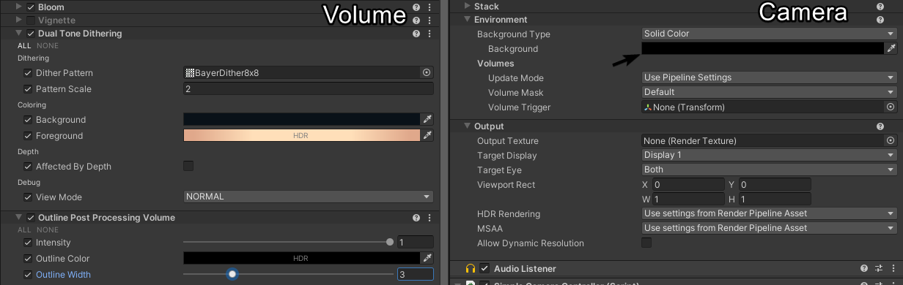
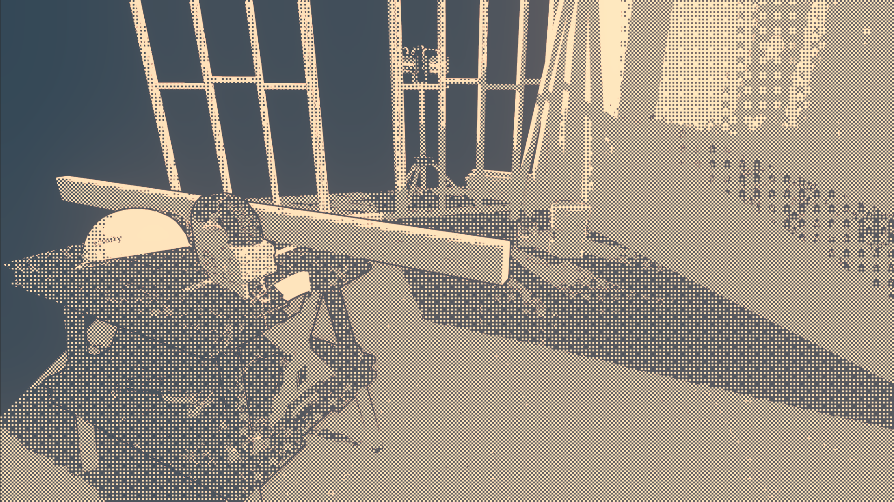

# Dual Tone Dithering
This converts your scene into a dithered version.

### Usage recommendations
- Its recommended that you make the background color of the scene (as in what the camera renders before dithering) black.
Otherwise you have the dithering on there as well. Which looks bad.
- In combination with the [Outline](./outline.md) it can look pretty good.

### Caveats
- While inspired from the game "Return of the Obra Dinn", its pretty barebone atm and missing some features and fixes, that Lucas Pope implemented.
Its is planned to fix it up, according to his [post on the "tigsource"-forum](https://forums.tigsource.com/index.php?topic=40832.800).
- As with the implementation of the effect in the game, this effect has a problem with moving elements. So use carefully.

### Settings

### Result
