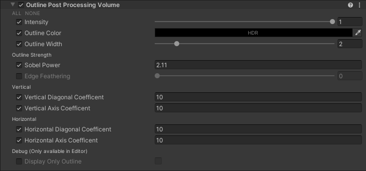
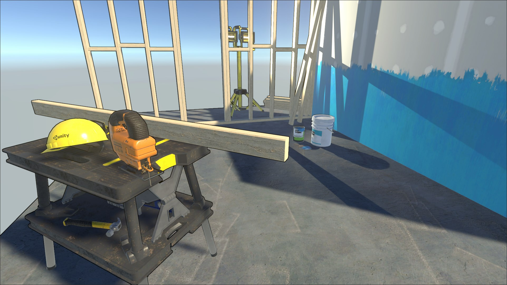

# Outline
This displays a outline around opaque elements.

#### Caveats
- This currently only uses the depth buffer, to calculate the outlines.
Its planned, that the normals are used as well, if available. (Defered Rendering, f.E.)
- Also, its only applied to opaque elements. Any transparent element is not included.
This may change, once the normals are used as well.

#### Settings

#### Result
